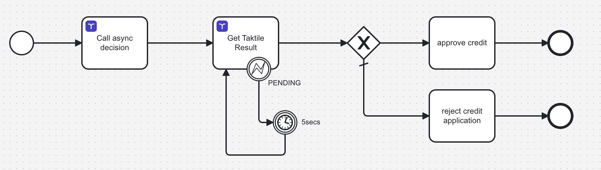

# Taktile Connector

This project contains two [Camunda Connectors](https://docs.camunda.io/docs/next/components/connectors/introduction-to-connectors/) to utilize the [Taktile](https://taktile.com) API to execute decisions and retrieve their results.



## Required Connector Secrets
Usage of these connectors requires the following connector secrets to be present:

| Secret name | Description  |  Example |
|---|---|---|
|TAKTILE_API_KEY | the API key of your Taktile project | |
|TAKTILE_API_ROOT_URL|the url pointing to your environment must have a **trailing slash (/)**| https://{custom-URL}.taktile.com/ |
|TAKTILE_ENVIRONMENT_URL_PART| last part of the URL pointing to either sandbox or production system | ```/sandbox/decide``` OR ```/decide``` |


## Configuration parameters

### Taktile Outbound Connector

| Parameter | Description  |  Example |
|---|---|---|
| Flow Slug  |  The Taktile Decision Flow Id | camunda-test  |
|  Payload|  The data to be passed to the Decision Flow |  |
| Decision Flow Version (Optional)  |  the version tag | v1.0 |
| Entity ID (Optional) | The Taktile Entity Id (if defined) | |
| Asynchronous Execution Mode | Force asynchronous execution, requires the Taktile Async Result Connector | |
| Result Expression  |  can be used to map the decision result data into process variables |   ```{ decisionId: response.body.metadata.decision_id, decisionData: response.body.data }```|


### Taktile Async Result Connector

| Parameter | Description  |  Example |
|---|---|---|
| Flow Slug  |  The Taktile Decision Flow Id | camunda-test  |
|  Taktile Decision Id |  the id of the executed decision (is being returned by the Taktile Outbound Connector's Result Expression) |  =decisionId |
| Result Expression  |  can be used to map the decision result data into process variables | ```{ decision: response.body.data.decision, creditLimit: response.body.data.credit_limit, decisionId: response.body.metadata.decision_id } ``` |
